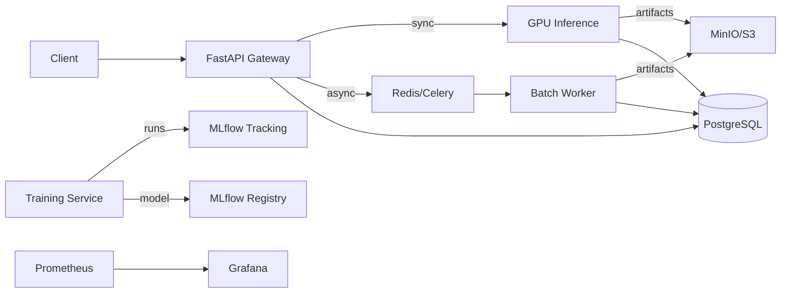

# Land Cover Change Detection Platform Architecture

## Goals

- Production-grade, cloud-native microservices for land cover change detection.
- Secure, scalable, and observable with clear model lifecycle management.
- Reproducible training and inference with versioned artifacts.

## System Overview

### Core Services

- **Gateway API (FastAPI)**: Auth, RBAC, rate limiting, request validation, and routing.
- **Inference Service (GPU)**: Real-time change detection using SNUNet-CBAM.
- **Batch Worker (Celery)**: Asynchronous batch jobs for large image sets.
- **Training Service**: Trains SNUNet-CBAM with BCE + Dice loss and logs to MLflow.
- **Metadata DB (PostgreSQL)**: Jobs, datasets, runs, model registry metadata.
- **Object Storage (MinIO/S3)**: Datasets, artifacts, inference outputs.
- **Experiment Tracking (MLflow)**: Metrics, params, artifacts, registry.
- **Monitoring (Prometheus + Grafana)**: Metrics, dashboards, alerts.

### Data Flow (High-Level)

1. Client uploads paired images (before/after) to object storage via Gateway.
2. Gateway submits job to Batch Worker or forwards to Inference Service for sync.
3. Inference Service loads model version from registry and returns change mask.
4. Outputs and metadata stored in object storage and PostgreSQL.
5. Training Service consumes datasets from storage and logs runs to MLflow.
6. Model registry promotes or rolls back versions based on evaluation gates.

### Security and Access

- JWT-based authentication and RBAC enforced at Gateway.
- Rate limiting and request-level auditing.
- Secrets stored in K8s secrets or external secret manager.
- Network policies restrict service-to-service access.

### Observability

- JSON structured logs with trace IDs.
- Prometheus metrics for request latency, GPU usage, queue depth.
- Grafana dashboards and alerting.

### Model Lifecycle and Registry

- MLflow model registry tracks versions and stages.
- Approval workflow for promoting models to `Staging` and `Production`.
- Rollback supported by reverting registry stage.

### Drift Detection Strategy

- **Data drift**: Monitor pixel intensity stats, class balance, and embedding stats.
- **Model drift**: Track IoU/F1 over time for labeled feedback batches.
- **Trigger**: Retrain when drift metrics exceed thresholds or on schedule.

### Automated Retraining

- Scheduled retraining via K8s CronJob.
- Triggered retrain on drift alarms or new dataset availability.
- Reproducible training with versioned datasets and configs.

## Reference Architecture Diagram (Mermaid)

